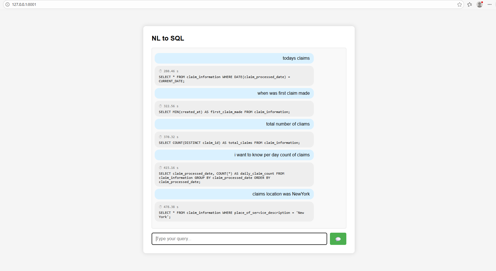

# A complete offline AI based program that does natural language to sql conversion. 
## Works under limited cpu i5 and 16GB RAM while other programs are also running
## Uses ollama and its models phi, phi4 

download, install & run ollama, https://ollama.com/download/windows  
get phi, phi4 model, `ollama pull phi`   
install python modules, `pip install fastapi uvicorn ollama`  
                       `pip install fastapi uvicorn ollama sentence-transformers faiss-cpu`  

`python Main.py`  
`python Main2.py`  

# Purpose that extends As Data Analysis Agent
## Finding AI best and efficient models to use offline that overcomes need of generating sql from natural laguage
## Providing best need context to it from huge schema set/descriptions
## Query can be used via SQL tools, DBeaver, MySQL Workbench to get data/reports etc...

Custom provided huge schema defination can be indexed doing  
`python .\index\indexer.py`  

Optionals:  
To see while you wait for ollama to respond  
`ollama ps`
`taskkill /IM ollama.exe` /F   
if you want to start ollama from command line   
`ollama serve`
`test.sh` simply run a prompt in ollama

